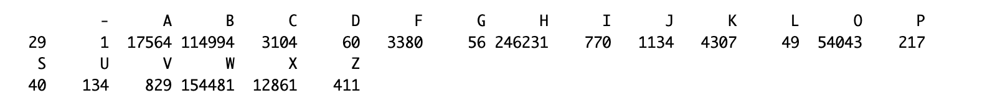
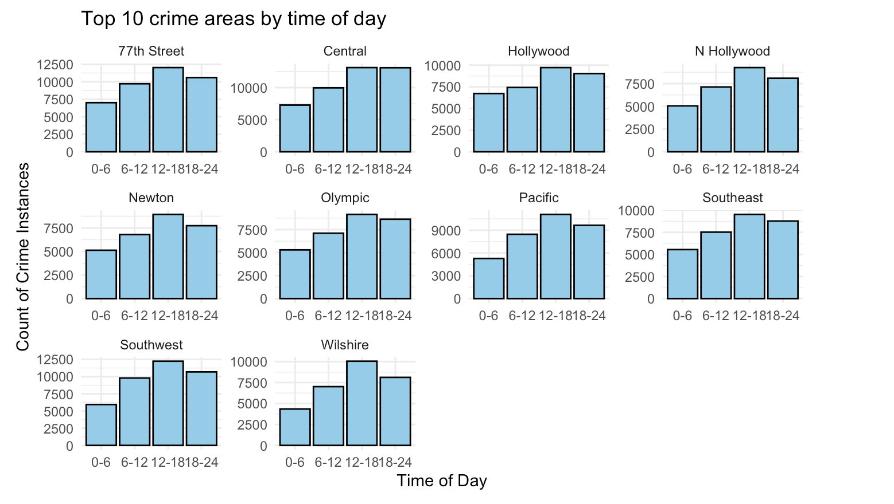

Insights into Crime: A Comprehensive Statistical Analysis of Crime in Los Angeles

Sahil Nale, Yejin Lee, Jiaxuan Huang

11 December 2023

Stat 15: Introduction to Data Science

Fall 2023

Prof. Robert Gould

<ol class="c4 lst-kix_r4089o45z2uw-0 start" start="1"><li class="c6 c11 c9 li-bullet-0">Abstract </li></ol>
This research was initially intended to investigate the location and time of crimes and predict crimes based on crime data in Los Angeles, in the past three years, provided by the Los Angeles Police Department. However, due to limited numerical variables, we were unable to conduct the data analysis we initially hoped to conduct, which involved implementing some sort of regression, so we were unable to make any solid conclusions based on the location and times of crimes. Instead, we shifted our study to investigate and identify the possible factors and patterns of crimes to bring to light information to help the public stay safe and avoid crimes in Los Angeles. We explored questions concerning the overall trend of crime, demographics of victims, times of crimes, and the length for a crime to be reported. We cleaned and explored the dataset on RStudio, and utilized multivariable plots, bootstrapping methods, hypothesis testing, and random forests to discover patterns and trends that could help answer our questions. From our study, we concluded that the overall trend of crime in LA in the past 3 years has increased, crimes were more likely to occur in the later half of the day rather than in the first half of the day, and it took about 10 days for a crime to be reported. We also found out that certain areas in LA have more crimes than others, more specifically towards northern/downtown LA. Finally, we identified that the demographics of individuals most likely to be a victim of crime were around 39 years of age, male, or of Hispanic descent. 

<ol class="c4 lst-kix_r4089o45z2uw-0" start="2"><li class="c6 c11 c9 li-bullet-0">Introduction</li></ol>
The following are questions that are going to be explored in this report:
<ol class="c4 lst-kix_xn22e9auwsfz-0 start" start="1"><li class="c6 c11 c9 li-bullet-0">How has crime changed throughout the past three years in Los Angeles? </li><li class="c6 c11 c9 li-bullet-0">Where are crimes most likely to occur in Los Angeles? </li><li class="c6 c11 c9 li-bullet-0">What demographics are most likely to be a victim of crime in Los Angeles?</li><li class="c6 c11 c9 li-bullet-0">When are crimes more likely to occur in Los Angeles? </li><li class="c6 c11 c9 li-bullet-0">How long does it take victims to report crimes after they have occurred in Los Angeles? </li></ol>

Our general motivation for looking into LA crime data was to find relationships and patterns that help bring more awareness and safety to the people of LA, by providing them with information that can help them avoid crime. We investigated demographics of victims such as age, sex, and descent, to see who was most likely to be a victim of a crime. We also looked into the times crimes would occur to determine whether crimes occur more during the day or at night, so we could inform individuals to be more aware during these times. The average length it took for a crime to be reported was also looked into to find out if crimes were reported in a timely manner because decreasing the number of days would inform the population of a crime quicker and increase awareness. The dataset used for this project is sourced from the Los Angeles Police Department (LAPD), a reputable and transparent public organization. It encompasses crime records in the city of Los Angeles from the year 2020 to the present date (last updated on October 18, 2023). The crime records are transcribed from original crime reports that were on paper first. The dataset is updated on a weekly basis, ensuring the inclusion of the latest information.&nbsp;While the LAPD is considered a trustworthy source, it is essential to acknowledge that there may be inaccuracies in the data. The dataset covers crimes reported in the city of Los Angeles, offering insights into various criminal activities over the specified time frame. Addresses are maintained to the nearest hundred block to preserve privacy, and in cases where the address is unavailable, the default coordinates are set to (0&ordm;, 0&ordm;). 

<ol class="c4 lst-kix_r4089o45z2uw-0" start="3"><li class="c6 c11 c9 li-bullet-0">Data Description</li></ol>
The dataset comprises 815,882 crime records and 28 variables, with &ldquo;dr_no.&rdquo; Key features we noticed at first were crime codes (Crm Cd) ranging from 110 to 956 and detailed geographic information such as &lsquo;location&rsquo;, &lsquo;area&rsquo; and &lsquo;area_name.&rsquo; We found these variables useful for our initial question on investigating and predicting where crime will occur in Los Angeles. This dataset was more appropriate to answer our finalized set of study questions because it had various categorical variables on victim demographics that will help us identify individuals most likely to be victims of crime and time records to help determine a time period most crimes would occur. Variables such as the date and time of crime occurrences are captured in &#39;date_rptd&#39;, &#39;date_occ&#39;, and &#39;time_occ&#39;, while victim demographics were reflected in &#39;vict_age&#39;, &#39;vict_sex&#39;, and &#39;vict_descent.&#39; 

To prepare the dataset for exploration and analysis, we took note of missing values for each variable. Most columns didn&rsquo;t have missing data except for &ldquo;weapon_used_cd&rdquo;, &ldquo;premis_cd&rdquo;, &ldquo;crm_cd_1&rdquo;, &ldquo;crm_cd_2&rdquo;, &ldquo;crm_cd_3&rdquo;, &ldquo;crm_cd_4&rdquo; with the most being ~99.9% missing values. When we removed rows with at least one missing value, we saw an extremely significant reduction with only about 6.946145e-03% of the original data remaining. It was also important to note that unknown sexes in &ldquo;vict_sex&rdquo; were indicated with &ldquo;X&rdquo; instead of being left blank. Unknown descents in &ldquo;vict_descent&rdquo; were also indicated with &ldquo;X.&rdquo; &ldquo;vict_sex&rdquo; also included unrelated values such as &ldquo;-&rdquo;, &ldquo; &ldquo;, &ldquo;H&rdquo; that were not explained, so rows without these values were taken out of the data set and put into a new dataframe, &ldquo;clean_crime&rdquo;, for better data visualization on victim sexes. 

<ol class="c4 lst-kix_r4089o45z2uw-0" start="4"><li class="c6 c11 c9 li-bullet-0">Data Exploration:</li></ol>

Most committed crimes

We start off the data exploration by seeing what crimes are the most common and what percent of the total crimes are these most committed crimes. We obtain the following list of most committed crimes and its criminal code with the most prevalent being stolen Vehicles with around 10.71% of all crimes being that crime.

Most used weapons in crimes where weapon was used

Next we see what weapons are the most common in crimes where a weapon was used and what percent of the total crimes are these weapons used in. We obtain the following list of most most used weapons in crimes where the weapon was used and its weapon code with the most used weapon being a &ldquo;STRONG-ARM&rdquo; with around 18.681% of crimes using that as a weapon.

Crimes by time

Next, part of the data exploration we attempt to explore the time occurrence of crimes variable in the dataset. We plot the variable into a histogram and split the bin widths to a value of a 100 to make each bin represent a single hour of the day as the time is provided in a 3 - 4 digit value representing military time.

Summary Statistics:

Min. 1st Qu. &nbsp;Median &nbsp; &nbsp;Mean 3rd Qu. &nbsp; &nbsp;Max. 

&nbsp; &nbsp; &nbsp; 1 &nbsp; &nbsp; 900 &nbsp; &nbsp;1400 &nbsp; &nbsp;1323 &nbsp; &nbsp;1845 &nbsp; &nbsp;2359

In the graph, we can see that crimes are following this cyclical pattern where starting at 5 am and every hour till 6 pm the number of crimes gradually increase in the time period and then from 6 pm till 5 am the number of crimes seem to drop in the time period and this cycle seems to repeat itself. However, there seems to be an anomaly in the distribution of time of crime occurrence where there is a rather large spike in crimes and seems to be the peak of the distribution. The earliest crime happens at 00:01 in the morning and latest at 23:59 in the night with the median timing being at 13:23 in the afternoon. 

Understanding Ages of victims

Next, part of the data exploration to answer our question about the demographics of victims we must understand the age of our victims. We also use a histogram for this variable so we can see the distribution of the age of victims in our data where the x-axis is the age of the victims and y-axis is counted in each bin where binwidth is equal to 10. We also use a box-plot to better visualize the outliers of the distribution.

Summary Statistics:

Min. &nbsp; 1st Qu. Median &nbsp;Mean &nbsp; 3rd Qu. &nbsp;Max. 

2.00 &nbsp; 28.00 &nbsp; 37.00 &nbsp; 39.58 &nbsp; 50.00 &nbsp;120.00

Standard Deviation: 15.586

Looking at the graph we can see that the distribution of victim ages are slightly skewed to the right. Victims beyond age 83 are considered outliers with about 3703 observations of victims beyond age 83 but taking into account for the dataset it is insignificant that is seen in the box plot. The median age of victims is about 37 years old and mean age is 39.58, and also we can see in histogram that the age range that has a peak and with the most victims of crimes is in the 30-39 years age range. The youngest victim is about 2 years old while the oldest is 120 years old. The ages of victims typically deviate from the mean by 15.586 years.

Understanding role of victim descent:&nbsp;

Next, part of the data exploration to answer our question about the demographics of victims we must also understand the descent of victims to get a better picture. We also use a bar graph for this variable so we can see the distribution of the descent of victims in our data where the x-axis is the descent of the victims and y-axis is a count in each group. 

Descent Code: A - Other Asian B - Black C - Chinese D - Cambodian F - Filipino G - Guamanian H - Hispanic/Latin/Mexican I - American Indian/Alaskan Native J - Japanese K - Korean L - Laotian O - Other P - Pacific Islander S - Samoan U - Hawaiian V - Vietnamese W - White X - Unknown Z - Asian Indian

Summary Statistics:

Looking at the graph we can see that Hispanics have the largest number of victims by a large margin with about 246,231 victims, then next coming White Americans with about 154,481 victims, and third is African Americans with about 114,994 victims. &nbsp;

Understanding the role of sex and crimes:

Sex code: F - Female M - Male X - Unknown

Looking at the graph we can see that men seem to have a larger count of crimes compared to women and the unknown, with the counts of unknown sex (7389) being significantly lower than the males (309967) and females (297221).

Summary Stats

F &nbsp; &nbsp; &nbsp; &nbsp; M &nbsp; &nbsp; &nbsp; &nbsp;X

297221 &nbsp;309967 &nbsp; 7389

Understanding the days to report crimes:

Next, part of the data exploration to answer our question about how long it takes victims to report their crime. We first of all have to calculate the days to report by finding the difference in days from the day the crime was reported and the day the crime occurred. Then we plot the calculated days on histogram to see the distribution of the day it takes for victims to report their crimes.

Summary Statistics:

Min. 1st Qu. &nbsp;Median &nbsp; &nbsp;Mean 3rd Qu. &nbsp; &nbsp;Max. 

&nbsp; &nbsp;0.00 &nbsp; &nbsp;0.00 &nbsp; &nbsp;1.00 &nbsp; 10.49 &nbsp; &nbsp;2.00 1370.00

SD 56.85481

Looking at the graph we can see that the distribution of days to report the crimes are heavily skewed to the right with a peak at 0. We can see that most crimes are reported on the same day of the crime, while the median number of days it takes to report is 1 day and the mean is 10.49 days. Quickest report time is 0 days with 25th percentile also being 0 days and slowest report time has been 1370 days later(3 years and 8 months). The IQR for this distribution is 2 days and the days to report a crime typically deviates from the mean by 56.85 days. 

Understanding Crimes by Areas:

Next, part of the data exploration we attempt to answer our question about where crimes are mostly likely to occur in Los Angeles using the dataset. We first of all summarize a list of the top 10 areas with the most crimes with the corresponding number of crimes that have been recorded in that area and what percentage of crimes happen in that area. We find that &ldquo;Central&rdquo; area has the most number of crimes reported with about 7.06% of all crimes in LA happening in that area, the &ldquo;77th Street&rdquo; area is second with 6.40% of all crimes in LA happening in that area, and lastly the &ldquo;Southwest&rdquo; area is third with 6.29% of all crimes in LA happening in that area.

Continued crimes by Areas: (Extra Credit Visualization - Using more than two variables)

We continued our exploration of the areas to answer the same question and create the following scatterplot below using the &ldquo;Latitude&rdquo; as the x-coordinate, &ldquo;Longitude&rdquo; as the y-coordinate, and &ldquo;Area&rdquo; of the crimes as the color for the point. The points are made smaller and semi transparent to help visualize density of crimes in areas. We observe that parts of Los Angeles that are more towards the north towards downtown parts of LA in the graph are rather more dense with crime and as you go towards the south-eastern areas of Los Angeles we see that the density of crimes is lesser.

&nbsp;

Understanding Crime over the past 3 years:

Next, part of the data exploration to answer our question about how crime has changed over the past 3 years in LA. We also use a bar graph for this variable so we can visualize the number of crimes in each year where the x-axis is the year and y-axis is a count in each group. We observe that in the bar plots each year the number of crimes in Los Angeles have been increasing with a slight increase from 151,104 crimes in the year 2020 to 158,853 in 2021 crimes to a rather larger jump to 178,250 in the year 2022.

Summary Stats

2020 &nbsp; 2021 &nbsp; 2022 

151104 158853 178250

Further Explorations on Variables in Subgroups
<ul class="c4 lst-kix_vm2l6d4ofhe8-0 start"><li class="c6 c11 c9 li-bullet-0">Variables may not independently account for the rate of crimes, there also may be correlational patterns between variables that together accounts for the rate of crimes, so we want to divide our data into subgroups by victim&rsquo;s sex, age interval, and crime occuring time of day and investigate the frequency of crime of different crime types, weapon types, case statuses, locations and areas, with respect to each subgroups. </li><li class="c6 c11 c9 li-bullet-0">For age interval we divide age groups to: 0-10, 10-20, 20-30, 30-40, 40-50, 50-65,65+; For day of time we divide time of a day to 0-6,6-12,12-18,18-24</li></ul>

Age Group:

A Glance of general frequency of crimes by victim age:

Frequencies of variables:

Crime types:&nbsp;&nbsp;&nbsp;&nbsp;&nbsp;&nbsp;&nbsp;&nbsp;&nbsp;&nbsp;&nbsp;&nbsp;&nbsp;&nbsp;&nbsp;&nbsp;&nbsp;&nbsp;&nbsp;&nbsp;&nbsp;&nbsp;&nbsp;&nbsp;&nbsp;&nbsp;&nbsp;&nbsp;&nbsp;&nbsp;&nbsp;&nbsp;&nbsp;&nbsp;&nbsp;&nbsp;&nbsp;&nbsp;&nbsp;&nbsp;&nbsp;&nbsp;&nbsp;&nbsp;&nbsp;&nbsp;&nbsp;&nbsp;Weapon Types:

Locations:

Areas:

Analysis

As we can see, in comparison to the general distribution, among all 4 variables we explore:
<ul class="c4 lst-kix_81q7xygkm71x-0 start"><li class="c6 c11 c9 li-bullet-0">Victims from ages 30 to 50 have significantly larger frequency of crimes regardless of the crime apart from Battery and Burglary where there is a spike of victims for crimes in the age groups of 50 year to 65 year olds. </li><li class="c6 c11 c9 li-bullet-0">Across victims regardless of age we see the same distribution as the frequency of most weapons used. </li><li class="c6 c11 c9 li-bullet-0">&nbsp;100 Grove Drive seems to have a large disproportionate amount of crime victims in the 30-40 age range, while crime on 7th seems to disproportionately affect victims age 50 - 65, and crime on 5th seems to be pretty equally distributed for victims ages 30-65, while the remaining locations seem to follow the same general shape as the overall distribution follows. &nbsp;</li><li class="c6 c11 c9 li-bullet-0">We observe for the areas in LA, they seem to follow the same distribution of crimes regardless of age. </li></ul>
Note: &nbsp;Locations have the most different pattern from general pattern, it might give us more information towards victim age.

Sex Group

A glance of counts of crime by sex:

&#8203;

Crime types:&nbsp;&nbsp;&nbsp;&nbsp;&nbsp;&nbsp;&nbsp;&nbsp;&nbsp;&nbsp;&nbsp;&nbsp;&nbsp;&nbsp;&nbsp;&nbsp;&nbsp;&nbsp;&nbsp;&nbsp;&nbsp;&nbsp;&nbsp;&nbsp;&nbsp;&nbsp;&nbsp;&nbsp;&nbsp;&nbsp;&nbsp;&nbsp;&nbsp;&nbsp;&nbsp;&nbsp;&nbsp;&nbsp;&nbsp;&nbsp;Weapon Types:

Areas:&nbsp;&nbsp;&nbsp;&nbsp;&nbsp;&nbsp;&nbsp;&nbsp;&nbsp;&nbsp;&nbsp;&nbsp;&nbsp;&nbsp;&nbsp;&nbsp;&nbsp;&nbsp;&nbsp;&nbsp;&nbsp;&nbsp;&nbsp;&nbsp;&nbsp;&nbsp;&nbsp;&nbsp;&nbsp;&nbsp;&nbsp;&nbsp; &nbsp; &nbsp; &nbsp; &nbsp; &nbsp; &nbsp; &nbsp; &nbsp; &nbsp; &nbsp; &nbsp; &nbsp; 

Location:

Analysis

We do acknowledge that there are many different sexes however, the number of observations in our dataset for other sex are very minimal and we are using only the three above as they have large enough observations to where we can drive insights to our dataset.

As we can see, in comparison to the general distribution, among all 4 variables we explore:
<ul class="c4 lst-kix_b9vlw194y9cq-0 start"><li class="c6 c11 c9 li-bullet-0">Unknown sex has least recorded crimes in all subgroups, apart from locations</li></ul><ul class="c4 lst-kix_113r4pj1jnxi-0 start"><li class="c6 c11 c9 li-bullet-0">Males exhibit a relatively higher count of crimes in most of the crime types apart from Intimate Partner Assault and Identity Theft.</li><li class="c6 c11 c9 li-bullet-0">For all the weapons men have higher counts of crime apart from verbal threats, where women were more likely to use them as a weapon</li><li class="c6 c11 c9 li-bullet-0">Across areas &ldquo;77th street&rdquo; has lot more counts for females victims than men and same goes for &ldquo;Southeast&rdquo; and &ldquo;Southwest,&rdquo; while the remaining areas either have similar counts or men are higher</li><li class="c6 c11 c9 li-bullet-0">Across locations, surprising we can see that locations like &ldquo;100 The Grove Dr&rdquo; and &ldquo;10200 Santa Monica Blvd&rdquo; the Unknown sex seems to have the highest frequency </li></ul>

Note: Weapon Types has the most different pattern from general pattern, it might give us more information towards victim sex,

Time of Day:

A glance of general pattern of crime by time of day:

Crime types:&nbsp;&nbsp;&nbsp;&nbsp;&nbsp;&nbsp;&nbsp;&nbsp;&nbsp;&nbsp;&nbsp;&nbsp;&nbsp;&nbsp;&nbsp;&nbsp;&nbsp;&nbsp;&nbsp;&nbsp;&nbsp;&nbsp;&nbsp;&nbsp;&nbsp;&nbsp;&nbsp;&nbsp;&nbsp;&nbsp;&nbsp;&nbsp;&nbsp;&nbsp;&nbsp;&nbsp;&nbsp;&nbsp;&nbsp;&nbsp;&nbsp;&nbsp;&nbsp;&nbsp;&nbsp;&nbsp;&nbsp;&nbsp;Weapon Types:

Locations:&nbsp;&nbsp;&nbsp;&nbsp;&nbsp;&nbsp;&nbsp;&nbsp;&nbsp;&nbsp;&nbsp;&nbsp;&nbsp;&nbsp;&nbsp;&nbsp;&nbsp;&nbsp;&nbsp;&nbsp;&nbsp;&nbsp;&nbsp;&nbsp;&nbsp;&nbsp;&nbsp;&nbsp;&nbsp;&nbsp;&nbsp;&nbsp; &nbsp; &nbsp; &nbsp; &nbsp; &nbsp; &nbsp; &nbsp; &nbsp; &nbsp; &nbsp;Areas:&nbsp;&nbsp;&nbsp;&nbsp;&nbsp;&nbsp;&nbsp;&nbsp;

Analysis

As we can see, in comparison to the general distribution, among all 4 variables we explore:

<ul class="c4 lst-kix_76nr4n2t0j4-0 start"><li class="c6 c11 c9 li-bullet-0">From &nbsp;12:00 a.m. - 6:00 a.m. exhibits relatively higher frequency of crimes in handgun, Unknown firearm, and semi-auto pistol (Weapon type)</li><li class="c6 c11 c9 li-bullet-0">18:00 - 23:59 exhibits relatively higher frequency of crimes in Handgun, Unknown firearm, and semi-auto pistol (Weapon type); NA - Unknown Crime (Crime type);6th, 6th Street, 7th, 7th Street, Figueros Street, and Hollywood (Location), Central (Area)</li></ul>

Note: We can observe that crime with firearms and certain streets has a relationship between day (6:00 - 18:00) and night (18:00 - 6:00).

Crime Over past 3 years:

To answer our research question about how crimes have changed over the past 3 years we take a look at the most common crimes in LA and see how they have changed over the past few years using faceted bar plots. We can clearly see that crime from 2020 to 2022 has increased dramatically in 2 main categories which includes Identity theft and Motor Theft over $950. Crime has also significantly increased in the &ldquo;Central&rdquo; and &ldquo;Olympic&rdquo; neighborhoods&rdquo; of LA over the past 3 years. &nbsp;

<ol class="c4 lst-kix_r4089o45z2uw-0" start="5"><li class="c6 c11 c9 li-bullet-0">Data Analysis Methods: </li></ol>

1. How has crime changed throughout the past three years? 

First, we look at the number of crimes for the past three years on a bar graph to visualize the counts of crimes each year and see how it&rsquo;s changed over the past few years. Then, we further go down into our subgroups and look at bar plots that are faceted by different crime types and areas, and case statuses to see how crime has changed over those variables. 

2. Where are crimes most likely to occur in Los Angeles? 

First, we break down each area and area code with their total count of crimes and the proportion of crime in LA that has occurred in that area. Then we assembled a type of density map using the latitude and longitude of each crime on a scatter plot to model a map and used the areas of each crime to color code the map and help visualize the crime areas that have the most and least crime.

3. What demographics are most likely to be a victim of crime? 

We focused on 3 main demographics for those most likely to become victims of crime: 
<ol class="c4 lst-kix_9mghzzr4b36b-0 start" start="1"><li class="c6 c11 c9 li-bullet-0">Age</li><li class="c6 c11 c9 li-bullet-0">Race</li><li class="c6 c11 c9 li-bullet-0">Sex</li></ol>

For our age, we conduct a bootstrap sampling distribution from our dataset where we calculate a confidence interval of the mean victim ages by conducting random samples with replacement of the victim ages and then calculate a mean and repeat it 1,000 times to estimate our true mean age of victims in LA. 

For each race, we only look at the top 3 observed races that include Hispanic, African American, and White as those races have the largest amounts of observations in the data set. We conduct two different statistical tests to see what races truly have more or less victims. The first statistical test we conduct is difference in proportions tests to see whether or not there is a difference in proportions in crime victims that are African American or White by constructing a bootstrap sampling distribution by conducting random samples with replacement, collecting the difference in proportion in crimes, and then repeating it a 1000 times. We also calculate the confidence interval to determine which race has more proportion of victims. The second test is almost the same with the races in the test being White and Hispanic instead.

For sex, we conduct a difference in proportions test to see whether or not there is a difference in proportions in crime victims that are female or male by constructing a bootstrap sampling distribution by conducting random samples with replacement and collecting the difference in proportions of crimes for each of the sexes and repeating it a 1000 times and using the confidence interval to determine which sex has more proportion of victims. 

We also construct a random forest model that classifies the sex of a victim using the other variable in the dataset and we are able to obtain a variable importance plot to see what variables seem to affect sex of the victims. (i.e what are the differences in circumstances between sexes for crime victims).

4. When are crimes more likely to occur in LA? 

We conduct a statistical test to determine whether or not there is a difference in proportion of crimes that happen in the first part of the day or the second part of the day using a bootstrap sampling distribution by conducting random samples with replacement and collecting the proportion of crimes that happen in part of the day and repeating it a 1000 times. 

5. How long does it take victims to report crimes? 

We construct a confidence interval for the true mean number of days it takes victims to report using a bootstrap sampling distribution by conducting random samples with replacement and collecting the proportion of crimes that happen in part of the day and repeating it a 1000 times. 

6. Based on other data, can we make predictions on victims&rsquo; sex?

In real life scenarios, if there is some missing information in some crime cases, are there any ways we can predict based on our given information to help case solving? One of the most direct and used information can be victim sex. &nbsp;Based on other information, we want to construct a random model to 

VI. Results:

1. How has crime changed throughout the past three years? 

Crime over the past 3 years has increased every year from 2020 to 2022 with reported crimes increasing all the from 151, 104 crimes to 178, 250 crimes which is an 18% increase in crime from 2020 to 2022. &nbsp;Specific crimes such as Identity Theft have increased by 149.55% from 2020 to 2022 and Motor Theft of Vehicles over $950 has increased by over 113.51%.&nbsp;Crimes have also increased in certain specific areas such as &ldquo;Central&rdquo; &nbsp;where crime has jumped 59.66% from 2020 to 2022 and &ldquo;Olympic&rdquo; where crime has jumped 29.74% from 2020 to 2022.

2. Where are crimes most likely to occur in Los Angeles? 

In the table, we are able to see that areas that have the most crimes are Central and 77th Street with 7.06% and 6.40% of the crimes happening there. When we look at the density map below we can see that these areas and their surrounding areas &nbsp;are specifically dense in the map depicting the higher levels of crime in the map. We are able to see roughly the shape of the city of LA with gaps depicting areas not part of the city of LA or low crimes/low populated areas. Areas of Los Angeles that are more towards the north towards downtown parts of LA that include the &ldquo;Central&rdquo; and &ldquo;77th Street&rdquo; areas are rather more dense with crime (i.e dangerous) and as you go towards the south-eastern areas of Los Angeles we see that the density of crimes is lesser and likely more safer. 

3. What demographics are most likely to be a victim of crime? 

Confidence interval: What is the true average age of a crime victim in Los Angeles?

<ol class="c4 lst-kix_ak827kur24sn-0 start" start="1"><li class="c6 c11 c9 li-bullet-0">Bootstrapping of mean age from crime data</li></ol>

&nbsp;
<ol class="c4 lst-kix_ak827kur24sn-0" start="2"><li class="c6 c11 c9 li-bullet-0">&nbsp;Conclude confidence interval</li></ol>
Using a 95% confidence interval we obtain the 2.5th percentile and the 97.5th percentile of the distribution and obtain the confidence interval of (39.53891, 39.61744). 

We can say that we are 95% confident that the mean age of a crime victim in LA is between 39.53891 and 39.61744.

Hypothesis test: is there evidence that male/females are more vulnerable to crimes?

From our crime data we observe a 0.57 (around 6%) difference in proportion, the difference does seem large. However, does this really implies irrelevance in the context of around 800,000 samples?

<ol class="c4 lst-kix_75pnteopnrft-0 start" start="1"><li class="c6 c11 c9 li-bullet-0">Test Construction</li></ol>
We set our hypotheses as the following with the significance level: alpha = 0.05.

H0: pmale&nbsp;- pfemale&nbsp;= 0 (Probability of being victim is the same between male/female)

HA: pmale&nbsp;- pfemale&nbsp;&ne; 0 (Probability of being victim is different between male/female)

<ol class="c4 lst-kix_75pnteopnrft-0" start="2"><li class="c6 c11 c9 li-bullet-0">Distribution Bootstrapping with H0</li></ol>
Based on our H0 &nbsp;assumption, we construct sample of 50% male - 50% female victim

sample and bootstrap it for 1000 times and obtain the following distribution plot:

<ol class="c4 lst-kix_75pnteopnrft-0" start="3"><li class="c6 c11 c9 li-bullet-0">Distribution analysis: </li></ol>
To our surprise, for a sample of this size, if we assume a 50% - 50% probability,

the distribution of proportion difference is almost 100% within 0.01, much smaller than &nbsp; &nbsp; &nbsp; &nbsp;

proportion difference 0.57 in our data, which means our p-value is 0 &lt; 0.05, H0&nbsp;gets &nbsp;

rejected so there is indeed a difference between the probability of male and female being &nbsp;

victim.

Hypothesis test: whether crimes are targeted(biased) towards between two races with a 5% significance level

White/Black/Hispanic descent victims Hypothesis testing: Is there evidence that points to &nbsp; &nbsp; whether white, black, or hispanic descents (top three descents in &ldquo;vict_descent&rdquo;) were more subjected to crimes?

<ol class="c4 lst-kix_80fnhxuyykqh-0 start" start="1"><li class="c6 c11 c9 li-bullet-0">Test Construction</li></ol>
H0: pwhite-&nbsp;pblack&nbsp;= 0 (the proportion of white and black victims are the same)

HA: pwhite-&nbsp;pblack&nbsp;&ne; 0 (the proportion of white and black victims are not the same)

<ol class="c4 lst-kix_80fnhxuyykqh-0" start="2"><li class="c6 c11 c9 li-bullet-0">Distribution Bootstrapping </li></ol>
Next, a bootstrap of the differences between the proportion of white descent victims and black descent victims was simulated, and resulted in the sampling distribution below. 

<ol class="c4 lst-kix_80fnhxuyykqh-0" start="3"><li class="c6 c11 c9 li-bullet-0">Hypothesis test analysis</li></ol>
All of the values in this distribution are non-zero so we can say that the p-value is 0. So we are able to reject the null hypothesis and say that we have convincing evidence that the proportion of white victims and crimes black victims of crime is not the same. Based on a 95% confidence interval (0.158000, 0.195805), we can conclude with 95% confidence that the true difference in proportions will never be 0, meaning the proportion of white descent victims and black descent victims cannot be the same. Additionally, the range of sample differences are also all positive, meaning the proportion of white descent victims is greater than the proportion of black descent victims. 

Next, we compare the difference of proportion between white descent victims and hispanic descent victims. 

<ol class="c4 lst-kix_8pi8ukwtfcx2-0 start" start="1"><li class="c6 c11 c9 li-bullet-0">Test construction</li></ol>
H0: pwhite-&nbsp;phispanic&nbsp;= 0 (the proportion of white and black victims are the same)

HA: pwhite&nbsp;- phispanic&nbsp;&ne; 0 (the proportion of white and black victims are not the same)

<ol class="c4 lst-kix_8pi8ukwtfcx2-0" start="2"><li class="c6 c11 c9 li-bullet-0">Distribution Bootstrapping</li></ol>
Next, a bootstrap of the differences between the proportion of white descent victims and hispanic descent victims was simulated, and resulted in the sampling distribution below. 
<ol class="c4 lst-kix_8pi8ukwtfcx2-0" start="3"><li class="c6 c11 c9 li-bullet-0">Hypothesis test analysis</li></ol>
All of the values in this distribution are non-zero so we can say that the p-value is 0. So we are able to reject the null hypothesis and say that we have convincing evidence that the proportion of white victims and crimes hispanic victims of crime is not the same. Based on a 95% confidence interval (-0.2214 -0.1826), we can conclude with 95% confidence that the true difference in proportions will never be 0, meaning the proportion of white descent victims and black descent victims cannot be the same. Additionally, the range of sample differences are also all negative, meaning the proportion of hispanic descent victims is greater than the proportion of white descent victims. 

&ndash; Overall analysis on victim descents

Using the two conclusions from the two hypothesis testings above, we concluded that hispanics were most likely to be victims of crime based on the conclusion that hispanic descent victim proportions were higher than white descent victimes, which were higher than black descent victims. 

Random Forest model for victim sex:

We want to construct a model to see given other crime information, what is the likely sex of the victim. This sometimes provides clues to solve cases when the victim&#39;s information is incomplete and also helps us tell what other variables are associated with a victim&rsquo;s sex. To achieve our goal, we want to build a random forest model. There is no gender discrimination but we have not yet learned the visualization of multi-class classification so we are only focusing on female/male classification. 

<ol class="c4 lst-kix_wjtzjxpcdyri-0 start" start="1"><li class="c6 c11 c9 li-bullet-0">Data Preprocessing&nbsp;</li></ol>
In our data exploration parts, we have found some variables that may provide information to the victim&#39;s sex: time_occ, area, crm_cd_desc, vict_age ,weapon_desc, location, vict_descent, statuses. We select these columns as well as vict_sex. For crime code description, weapon description, and locations, they have too many types as categorical variables, so we only filter the top 12 of them. After these steps we are left with a 5000 rows data, we then split them into training set and testing set

<ol class="c4 lst-kix_wjtzjxpcdyri-0" start="2"><li class="c6 c11 c9 li-bullet-0">Data Training </li></ol>
We put our filtered training dataset to train with random forest model, here is a summary of model and the importance of each variable:

Model Summary

Type of random forest: classification

&nbsp; &nbsp; &nbsp; &nbsp; &nbsp; &nbsp; &nbsp; &nbsp; &nbsp; &nbsp; &nbsp;Number of trees: 2000

No. of variables tried at each split: 3

&nbsp; &nbsp; &nbsp; &nbsp; OOB estimate of &nbsp;error rate: 32.79%

Confusion matrix:

&nbsp; &nbsp; F &nbsp; &nbsp;M class.error

F 579 &nbsp;854 &nbsp; 0.5959525

M 442 2077 &nbsp; 0.1754665

Importance of each variable

&nbsp;&nbsp; &nbsp; &nbsp; &nbsp; &nbsp; &nbsp;
<ol class="c4 lst-kix_wjtzjxpcdyri-0" start="3"><li class="c6 c11 c9 li-bullet-0">Data Validation </li></ol>
We validate our model with the test data and generates confusion matrix:

Test Misclassification Rate: 0.30

<ol class="c4 lst-kix_wjtzjxpcdyri-0" start="4"><li class="c6 c11 c9 li-bullet-0">Reflection</li></ol>
The misclassification rate of females is much higher than male, maybe because there are too many male instances than females, and this is also not the case of population. It can lead to bad results if the predictor predicts more victims male which is not good for the population prediction. We want to balance the crime_filtered data. We can see from our datasets there are more male instances than female. 

<ol class="c4 lst-kix_wjtzjxpcdyri-0" start="5"><li class="c6 c11 c9 li-bullet-0">Revision </li></ol>
We downsample male instances to balance the instances of both classes such that the number of instances in both classes are the same. We then repeat our training/validation for the new data to obtain our new models statistics and confusion matrix:

Model Summary

Type of random forest: classification

&nbsp; &nbsp; &nbsp; &nbsp; &nbsp; &nbsp; &nbsp; &nbsp; &nbsp; &nbsp; &nbsp;Number of trees: 2000

No. of variables tried at each split: 2

&nbsp; &nbsp; &nbsp; &nbsp; OOB estimate of &nbsp;error rate: 37.11%

Confusion matrix:

&nbsp; &nbsp; F &nbsp; M class.error

F 913 547 &nbsp; 0.3746575

M 535 921 &nbsp; 0.3674451

Confusion matrix

Test Misclassification Rate: 0.357

<ol class="c4 lst-kix_wjtzjxpcdyri-0" start="6"><li class="c6 c11 c9 li-bullet-0">Interpretation:</li></ol>
For the original data set, we have a test misclassification rate of 0.30, which is lower than the balanced data set, 0.357. However, the balanced data set does have a more balanced misclassification rate on each class. &nbsp;Since our down-sampling has eliminated about one third of the total instances,the increase in misclassification rate may be due to the decrease in the size of our training data set. A misclassification rate of 0.3 ~0.36 is much better than predicting with mean, but it is still not accurate and reliable enough. Considering the important influence of training data set size, We can consider adding more instances from years prior to 2017 in Los Angeles, as well as instances from other large cities to further increase our model&rsquo;s performance. We also find out that variables such as the time a crime occurs and the victim&#39;s age are the most influential factors into the victim&rsquo;s sex.

4. &nbsp; When are crimes more likely to occur in LA?&nbsp;

Hypothesis test: Is there a difference in the amount of crimes that happen in the first half of the day or the second half of the day?

<ol class="c4 lst-kix_m6fmsly0hibk-0 start" start="1"><li class="c6 c11 c9 li-bullet-0">Test construction</li></ol>
We set our hypotheses as the following with the significance level: alpha = 0.05.

H0: pfirst&nbsp;half&nbsp;- plater&nbsp;half&nbsp;= 0 (Crime is same throughout the day)

HA: pfirst&nbsp;half&nbsp;- plater&nbsp;half&nbsp;&ne; 0 (Crime differs throughout different halves of the day)

<ol class="c4 lst-kix_m6fmsly0hibk-0" start="2"><li class="c6 c9 c11 li-bullet-0">Distribution Bootstrapping</li></ol>

Summary Stats

Min. 1st Qu. &nbsp;Median &nbsp; &nbsp;Mean 3rd Qu. &nbsp; &nbsp;Max. 

-0.2633 -0.2572 -0.2557 -0.2558 -0.2543 -0.2487

<ol class="c4 lst-kix_m6fmsly0hibk-0" start="3"><li class="c16 c11 c9 li-bullet-0">Hypothesis test analysis</li></ol>
We can see that the min value of the and max value of the distribution are negative so all the differences are non-zero so we can say that the p-value is 0. Since p-value &lt; 0.05, we are able to reject the null hypothesis and say that we have convincing evidence that crime differs throughout the different halves of the day.

Since, the entire interval is negative we are able to conclude that more crimes happen in the later half of the day. 

Confidence interval: What time is a crime most likely to occur?

&nbsp;
<ol class="c4 lst-kix_hd1gwgwlgyvs-0 start" start="1"><li class="c6 c11 c9 li-bullet-0">Bootstrapping</li></ol>

We obtain the following simulated bootstrap distribution for mean. 

<ol class="c4 lst-kix_hd1gwgwlgyvs-0" start="2"><li class="c6 c11 c9 li-bullet-0">Confidence interval analysis</li></ol>
Using a 95% confidence interval we obtain the 2.5th percentile and the 97.5th percentile of the distribution and obtain the confidence interval of (1321.322, 1324.659). 

We can say that we are 95% confident that the mean time a crime occurs is between 13:21.322 and 13:24.659.

5. What is the true average number of days it takes for a crime to get reported? 

Since only the date reported is recorded (date_rptd), we were only able to look into the average days it took for a crime to be reported by taking the difference between the day the crime occurred (date_occ) and the day the crime was reported (date_rptd). A bootstrap sampling distribution of these differences resulted in the distribution below. Using a 95% confidence interval (10.13930 10.89253), we are 95% confident that the true average days it took for a crime to be reported took around 10 days. 

Hypothesis test: is there evidence that weekend/weekdays have more crimes?

<ol class="c4 lst-kix_8w0bpvt98mi1-0 start" start="1"><li class="c6 c11 c9 li-bullet-0">Test construction</li></ol>
H0:, pweekday&nbsp;= 5/7,pweekend&nbsp;= &nbsp;2/7 (There is no difference in crimes per day, then weekdays will consist 5/7 of all crimes, weekend&nbsp;consist 1 - 5/7 = 2/7 since they are mutually exclusive.)

HA: pweekday&nbsp;&nbsp;&ne;&nbsp;5/7,pweekend&nbsp;&ne;&nbsp; 2/7 (There is a difference in crimes per day, then weekdays will not consist 5/7 of all crimes and consistent;y weekends will not consist 2/7)

Significance Value: alpha = 0.05

<ol class="c4 lst-kix_8w0bpvt98mi1-0" start="2"><li class="c6 c11 c9 li-bullet-0">Distribution bootstrapping</li></ol>

<ol class="c4 lst-kix_8w0bpvt98mi1-0" start="3"><li class="c6 c11 c9 li-bullet-0">Hypothesis testing analysis</li></ol>
As we can see, there are at least around 0.2-0.3 data more extreme than our statistic, so p-value &gt; 0.05, we fail to reject the null hypothesis, so there is no evidence that weekdays or weekends has more crimes per day

VIII. Conclusion

From our study, we are able to conclude that the overall trend of crime in LA in the past 3 years has increased by over 18%, with more specifically crimes such as Identity Theft &amp; Motor Theft over $950 increasing over 50%, and crimes in areas such as Central and Olympic increasing over 25%. Crimes in Los Angeles are more likely to occur in the later part of the day rather than at night with the average time a crime happens being at around 13:21.32 and 13:24.66, and found that it would take about 10 days on average for a crime to be reported. We also observed that certain parts of Los Angeles are more dangerous than others with crimes being more in counts and dense towards north and downtown LA, while areas towards south-eastern Los Angeles are safer with lesser density of crime. We find out that our victims sex&rsquo;s are mostly associated by the time a crime occurs and their ages. Finally, we identified that the demographics of an individual most likely to be a victim of crime was a victim that is around the age between 39.53 years old and 39.62 years old, male, and of Hispanic descent. Due to the lack of numerical variables that were of significance, we were unable to implement many other types of graphs such as scatter plots, establish any types of correlation between numerical variables in our report, or implement any sort of regression model in our report that could answer the question &ldquo;Can we predict the time of a crime in LA based on other variables ?&rdquo; We only compared the races/sexes that had a significant number of observations, so our analysis may not be appropriate to understand crime for these other races/sexes. If we had more data of the general Los Angeles public and criminal data combined, in the future we would like to create a model that could predict if a person with specific demographics is likely to become a victim of a crime in their lifetime and what specific crime is that person most likely to be a victim to.

XI. References

Department, L. A. P. (2023, December 6). Crime data from 2020 to present: Los Angeles - open data portal. Crime Data from 2020 to Present | Los Angeles - Open Data Portal. https://data.lacity.org/Public-Safety/Crime-Data-from-2020-to-Present/2nrs-mtv8 

</body></html>
